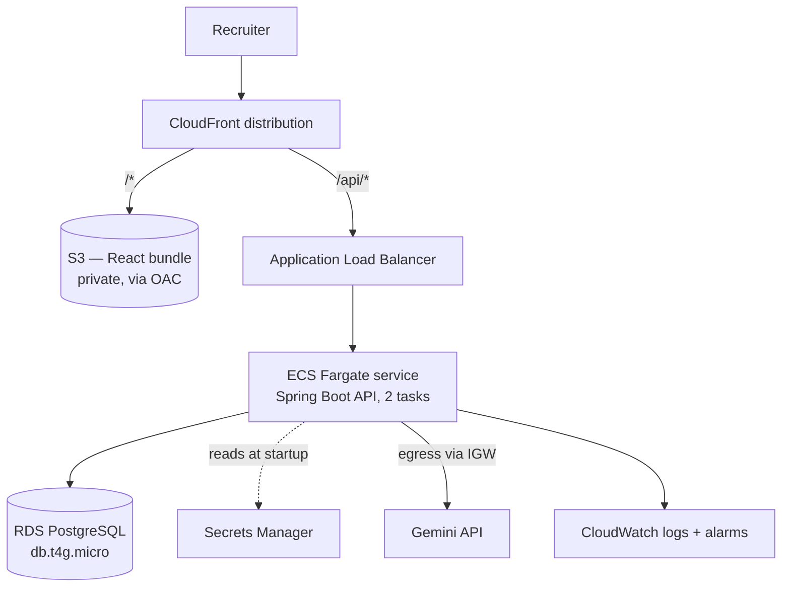

# Deploying this on AWS

How the app in this repo would run in a low-traffic production environment, and why each choice.
Region assumed to be `ap-south-1` (Mumbai): the channel catalogue and the recruiters using it are
India-based, so latency and data residency are both simpler there.

## What is actually being deployed

Start from what `docker compose up` runs today, because the AWS design is a translation of it:

| Container | What it does | Stateful? |
|---|---|---|
| `joveo-supply-web` | nginx — serves the built React bundle, proxies `/api` to the API | No |
| `joveo-supply-api` | Spring Boot — three endpoints, all under `/api` | No |
| `joveo-supply-db` | Postgres — the channel catalogue, 8 rows of reference data | Yes |

Three properties drive everything below:

1. **The API is completely stateless.** No sessions, no local disk, no in-memory cache that matters.
   Any request can go to any instance.
2. **The application never writes to the database.** It reads the channel catalogue and nothing
   else — campaigns and results are not persisted. Read replicas, write scaling and failover
   urgency all drop away.
3. **There is exactly one outbound dependency**: `generativelanguage.googleapis.com` for the Gemini
   brief parser. It is optional — the app runs fully without it.

## The mapping

| Local | AWS | Note |
|---|---|---|
| nginx container | **CloudFront + S3** | The container itself disappears — see below |
| Spring Boot container | **ECS Fargate** behind an **ALB** | 0.25 vCPU / 0.5 GB |
| Postgres container | **RDS PostgreSQL** `db.t4g.micro` | |
| `GEMINI_API_KEY` env var | **Secrets Manager** → task definition | |
| `SPRING_DATASOURCE_*` env vars | **Secrets Manager** → task definition | |

**The nginx container has no AWS equivalent, and that is the point.** It does two jobs locally:
serve static files, and proxy `/api` so the browser sees one origin. In AWS, CloudFront does both —
one distribution with two behaviours, `/api/*` to the ALB origin and `/*` to the S3 origin. The
same-origin assumption the frontend code makes is preserved end to end, so there is no CORS config
in production and no environment-specific API base URL in the client.

## Component choices, and why

**Frontend — S3 + CloudFront.** The React build is fully static. Origin Access Control keeps the
bucket private so S3 is never addressed directly, CloudFront terminates TLS with an ACM certificate,
and Vite already emits content-hashed asset filenames so they cache indefinitely. A couple of
dollars a month.

**API — ECS Fargate behind an ALB.** Not EC2: nothing here justifies patching and scaling instances
for one stateless container. Not Lambda: a Spring Boot JVM cold start is genuinely painful on an
interactive request, and this API is long-lived rather than spiky — a warm container beats fighting
SnapStart or a native-image build. Two tasks across two AZs gives rolling deploys and survives an AZ
failure; at this traffic level that is redundancy, not capacity.

**Database — RDS PostgreSQL, `db.t4g.micro`, single-AZ, 20 GB gp3.** Not Aurora: its floor cost is
not justified by eight rows of reference data. Single-AZ is a deliberate low-traffic choice, and
unusually defensible here — the catalogue is reproducible from `data.sql`, so the worst case of
losing the instance is a redeploy, not data loss. That stops being true the moment campaigns are
persisted, at which point Multi-AZ is the first thing to change.

**Networking — tasks in public subnets, not private subnets behind NAT.** This is the least obvious
choice in the design and the one with the biggest cost consequence. The API needs egress to reach
the Gemini API. The textbook answer puts tasks in private subnets with a NAT Gateway, but NAT is
roughly **$32/month plus data processing in `ap-south-1` — comfortably the largest line in the
budget**, spent to route one optional outbound call. So: tasks run in public subnets with
`assignPublicIp: ENABLED`, egress through the Internet Gateway, and a security group that accepts
inbound **only** from the ALB's security group. Nothing is reachable from the internet despite the
public subnet. If a compliance requirement demands private subnets, add NAT and accept the ~$32.

**Secrets — Secrets Manager**, injected into the task definition via `valueFrom` so values never
appear in the repo, the image, or the task definition JSON. Two secrets: the RDS credentials
(rotation wired) and `GEMINI_API_KEY` (rotated by hand). Note the app treats a missing key as a
supported state, so a rotation failure degrades the brief parser rather than breaking the service.

**Observability — CloudWatch.** Structured JSON logs from the container, Container Insights for task
metrics, and alarms that would actually page someone: ALB 5xx rate, p95 target response time, RDS
CPU and free storage.

**CI/CD — GitHub Actions → ECR → ECS rolling deploy.** `mvn verify` and `npm run build` gate the
image push. The frontend syncs to S3 with a CloudFront invalidation limited to `index.html` — the
hashed assets never need invalidating.

## Three things the app needs before it can deploy

These are real gaps in the current code, not hypotheticals.

**1. There is no health endpoint.** An ALB target group needs one, and Spring Boot Actuator is not
on the classpath. Without it the ALB would have to health-check `GET /api/channels`, which hits the
database every 30 seconds and couples liveness to the database being up — a slow query would cause
the ALB to kill healthy tasks. Add `spring-boot-starter-actuator` and point the target group at
`/actuator/health/liveness`, with `/actuator/health/readiness` gating traffic.

**2. Seeding races across tasks.** `spring.sql.init.mode=always` re-runs `schema.sql` and `data.sql`
on **every** boot, and `schema.sql` starts with `DROP TABLE IF EXISTS channel`. With one container
that is a convenience. With two Fargate tasks starting together it is a race: one task can drop and
re-seed the table while the other is serving reads from it. Before running more than one task,
either move seeding to a migration tool (Flyway, run once per deploy) or set
`spring.sql.init.mode=never` in the production profile and seed as a one-off task.

**3. The API is unauthenticated.** There is no Spring Security on the classpath — every endpoint is
open. For a demo that is fine; for production the intended shape is a Cognito user pool with the API
validating JWTs as an OAuth2 resource server. That also sets up the companion migration doc: Supabase
Auth and Cognito are both OIDC-shaped, so the application-side change is which issuer it trusts.

## Approximate monthly cost, low traffic, ap-south-1

| Item | Est. |
|---|---|
| ECS Fargate (0.25 vCPU / 0.5 GB, 2 tasks) | $18–20 |
| RDS `db.t4g.micro` single-AZ + 20 GB gp3 | $14–16 |
| Application Load Balancer | ~$18 |
| S3 + CloudFront | $2–4 |
| CloudWatch logs, metrics, alarms | ~$2 |
| Secrets Manager (2 secrets) | ~$1 |
| **Total** | **≈ $55–60** |

Dropping to a single Fargate task takes it to roughly $45. Adding a NAT Gateway takes it to roughly
$90 — which is why the public-subnet choice above matters more than it first looks.

**The ALB is the awkward line.** At ~$18/month it is the largest fixed cost and it carries almost no
traffic; it exists for TLS termination, health checks, and a stable CloudFront origin. The honest
alternatives are an API Gateway HTTP API (pay-per-request, effectively free at this volume, at the
cost of another routing layer to reason about) or pointing CloudFront at the task directly. I would
keep the ALB while traffic is uncertain and revisit it the moment someone asks why a nearly-idle app
costs $55 a month.

## What I would add before calling this production

- The three gaps above — health endpoint first, it blocks the ALB.
- Multi-AZ RDS once campaigns are persisted, and a restore actually tested rather than assumed.
- WAF on CloudFront with rate limiting on `/api/parse-brief` — it is the only endpoint that costs
  real money per call, and it is unauthenticated today.
- Terraform for all of it. This is about 200 lines and should not live in the console.
- A nightly job to refresh channel cost and volume figures from partner reporting, once those are
  measured rather than editorial. EventBridge Scheduler → SQS → a scheduled ECS task, with SQS
  rather than bare cron so retries and a dead-letter queue come free.
