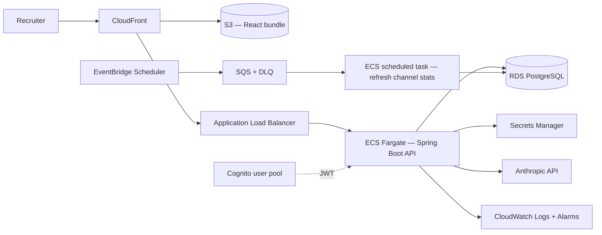

# Deploying this on AWS

Target: a low-traffic production deployment of the app in this repo — a stateless Spring Boot API,
a static React bundle, one small Postgres database, and one outbound call to the Anthropic API.
Region assumed to be `ap-south-1` (Mumbai), since the channel catalogue and the recruiters using it
are India-based and the latency and data-residency story is simpler there.

## Component choices, and why

**Frontend — S3 + CloudFront.** The React build is fully static. Origin Access Control keeps the
bucket private, CloudFront terminates TLS with an ACM certificate and caches the hashed asset
filenames Vite already emits. Costs a couple of dollars a month at this traffic. CloudFront also
fronts `/api/*` and forwards it to the ALB, so the browser talks to one origin and there is no CORS
configuration in production — the same same-origin assumption the Vite proxy makes in development.

**API — ECS Fargate, one service, 0.25 vCPU / 0.5 GB, behind an ALB.** Not EC2, because there is
nothing here that justifies patching and scaling instances for a single stateless container. Not
Lambda: a Spring Boot app's JVM cold start is genuinely painful on an interactive request, and the
API is long-lived rather than spiky — a warm container is both faster and simpler than fighting
SnapStart or a native-image build. Two tasks across two AZs behind the ALB gives rolling deploys
and survives an AZ failure; at this traffic level it is redundancy, not capacity.

**Database — RDS PostgreSQL, `db.t4g.micro`, single-AZ, 20 GB gp3.** Single-AZ is a deliberate
low-traffic choice and the first thing I would change: real production is Multi-AZ, which roughly
doubles the database line for an automatic failover. Not Aurora — Aurora's floor cost is not
justified by a dataset that is currently eight rows of reference data plus whatever campaign
history accumulates. Automated backups with 7-day retention and a deletion-protection flag.

**Auth — Cognito user pool, JWT validated by Spring Security.** Managed, and the free tier covers
this comfortably. It also sets up the migration story in the companion doc: Supabase Auth and
Cognito are both OIDC-shaped, so the application-side change is which issuer the resource server
trusts.

**Background work — EventBridge Scheduler → SQS → a scheduled ECS task.** Channel cost and volume
figures are editorial estimates today; in production they would be refreshed from partner reporting
on a nightly cadence. SQS rather than a bare cron because retries and a dead-letter queue come free,
and a refresh that fails at 03:00 should be visible in the morning rather than silently missing.

**Secrets — AWS Secrets Manager**, injected into the task definition as `valueFrom`. The database
credentials and `ANTHROPIC_API_KEY` never appear in the repo, the image, or the task definition
JSON. Rotation is wired for the DB credentials; the Anthropic key is rotated manually.

**Observability — CloudWatch.** Structured JSON logs from the container, Container Insights for
task-level metrics, and alarms that would actually page someone: ALB 5xx rate, p95 target response
time, RDS CPU and free storage, and SQS DLQ depth above zero.

**CI/CD — GitHub Actions → ECR → ECS rolling deploy.** `mvn verify` and `npm run build` gate the
image push; the frontend build syncs to S3 with a CloudFront invalidation limited to `index.html`
(the hashed assets never need invalidating).

## Approximate monthly cost, low traffic, ap-south-1

| Item | Est. |
|---|---|
| ECS Fargate (0.25 vCPU / 0.5 GB, 2 tasks) | $18–20 |
| RDS `db.t4g.micro` single-AZ + 20 GB gp3 | $14–16 |
| Application Load Balancer | ~$18 |
| S3 + CloudFront | $2–4 |
| CloudWatch logs, metrics, alarms | ~$2 |
| Secrets Manager (2 secrets) | ~$1 |
| **Total** | **≈ $55–60** |

Dropping to a single Fargate task takes this to roughly $45.

**The ALB is the awkward line.** At about $18/month it is the largest fixed cost in the stack and it
is carrying almost no traffic — it is there for TLS termination, health checks, and a stable target
for CloudFront. If cost mattered more than operational neatness, the honest alternatives are an
API Gateway HTTP API (pay-per-request, effectively free at this volume, at the cost of a second
routing layer to reason about) or pointing CloudFront straight at the Fargate task behind a
lightweight proxy. I would keep the ALB while traffic is uncertain and revisit it the moment
someone asks why a nearly-idle app costs $55 a month.

## What I would add before calling this production

- Multi-AZ RDS, and a restore actually tested rather than assumed.
- WAF in front of CloudFront, with rate limiting on `/api/parse-brief` — it is the only endpoint
  that costs real money per call.
- Terraform for all of it. The above is describable in about 200 lines and should not live in
  the console.
